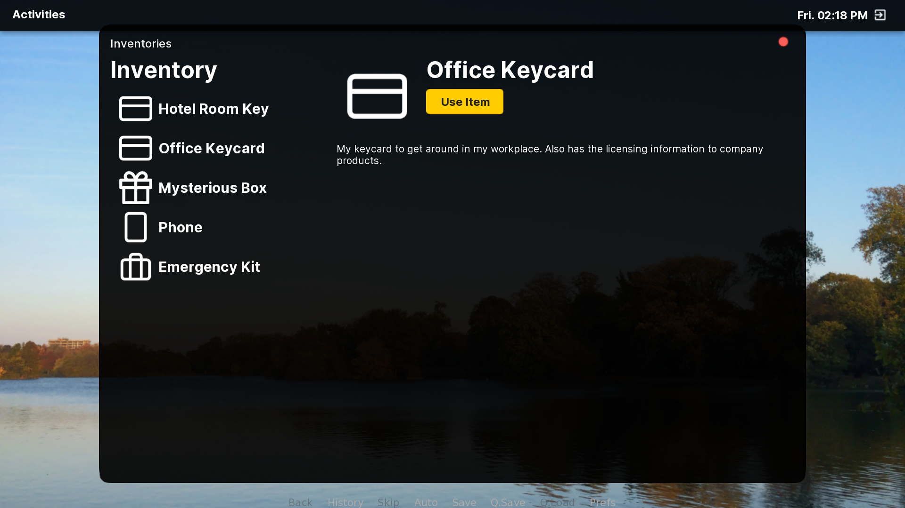
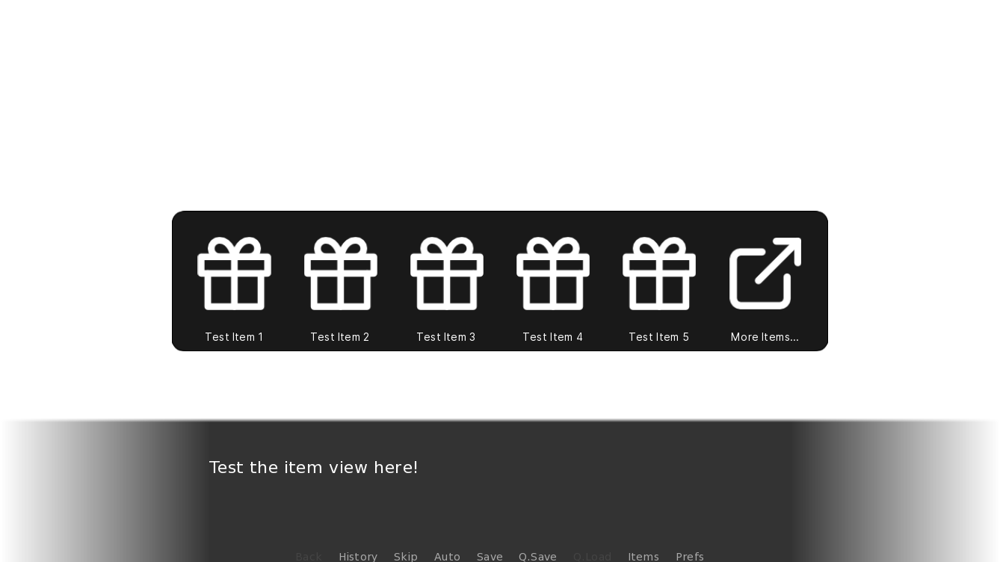

# Inventories



Inventories is a great tool included with AliceOS to set up, manage, and use an inventory system in any AliceOS-powered visual novel. Developers can easily define items and manage the inventory with the Inventories API, and users get an easy experience with managing items using the Inventories app built with ScreenKit. Inventories is an opt-in system, so if you don't think you need Inventories, you don't have to work with it at all.

## Features

The Inventories app comes with some great features that work well with AliceOS:

- A fast and easy way to define items using the `ASInventoryItem` class that can state what an item is and how it can be used
- Methods to add and remove items from the inventory, as well as importing an inventory from a Python list
- GUI for players to use an item and see what they have in store
- Optional HUD to let players access the first five items in the inventory

## A sample inventory system

Creating and maintaining the inventory can be accomplished easily in Ren'Py:

```renpy
label the_story:
    
    python:
        used_office_key = False

        def use_office_key():
            store.used_office_key = True

        office_key_item = ASInventoryItem(
                        name="Office Key", 
                        description="Opens up the office door", 
                        canBeUsedOnce=True, 
                        specialUseCase=use_office_key
                    )

    "Quickly, I look around the room for any keys to open the door and finally get out of the office."
    "After searching under a few desks, I manage to find a key."
    $ inventory.addItem(office_key_item)

    while not used_office_key:
        "Great! Now to just get the door open."

    "The key unlocks the door, and I happily skip out."

    return
```

When a player uses the item via the Inventories app, all of the logic for handling one-time use and even removing the item from the inventory is taken care of for you.

## Creating an item

The inventory works with the `ASInventoryItem` class as a means of defining items and how they can be used in Inventories. Below are the required fields in the constructor (`__init__`).

!!! note
    Items in the inventory must use the `ASInventoryItem` class to ensure compatibility with the app and with the inventory methods.

- `name`: String containing the name of the item. Defaults to `"Item"`
- `description`: String containing the description of the item. Defaults to an empty string.
- `canBeUsed`: Boolean dictating whether the item can be used. Defaults to `True`.
- `specialUseCase`: Function that dictates any game-changing behavior or any other actions to be completed when an item is used. Defaults to `None`.
- `canBeUsedOnce`: Boolean dictating whether the item is a one-time-use. Defaults to `False`.
- `imageName`: String containing the path to the image. Should be 128px by 128px. Defaults to the standard missing item image path.

## Managing the inventory

The inventory can be invoked from `inventory` and is an instance of the `ASInventories` class, an app written with AppKit. The following methods are provided to make inventory management easier:

### `applicationWillLaunch()`

Open the Inventories app. Inherited from `ASAppRepresentative`.

### `callRecentItems()`

Opens the Inventories HUD which lets players access the first five items in the inventory. Useful in the quick menu or in scenarios where opening the Inventories app is impractical.

### `isEmpty()`

Returns whether the inventory is empty or not as a boolean.

### `retrieve()`

Returns the inventory as a list of items (`ASInventoryItem`).

### `containsItem(item)`

Checks whether the inventory contains a specific item.

**Parameters**

- `item`: The item to check for (`ASInventoryItem`)

**Returns**: Boolean value stating whether the item is in the inventory

### `getItemByName(name)`

Looks for an item in the inventory and returns it, if possible.

**Parameters**

- `name`: String containing the name of the item

**Returns**: The appropriate `ASInventoryItem` object if found or `None` if the search fails.

### `addItem(item)`

Adds an item to the inventory if possible and displays a notification if the user permits.

**Parameters**

- `item`: The item to insert (`ASInventoryItem`)


**Raises**: May raise a `TypeError` if the item isn't an `ASInventoryItem` object

### `useItem(item)`

Use an item if it exists in the inventory. Also removes any items that can no longer be used.

**Parameters**

- `item`: The item to use (`ASInventoryItem`)

**Raises**: May raise a `KeyError` if the item is not in the inventory

### `importFromList(list)`

Imports the inventory from a Python list by appending each item to the inventory.

**Parameters**

- `list`: The list containing `ASInventoryItem` items to import

**Raises**: May raise a `TypeError` if the list contains elements that are not `ASInventoryItem` objects

## Saving the inventory

It might be helpful to make sure that the player's inventory is properly saved since the class re-initialized with an empty inventory from the beginning. We recommend storing the current inventory before closing out the game. For example, if you wanted to store the inventory to the persistent file:

```renpy
label quit:
    $ persistent.saved_inventory = inventory.retrieve()
    return
```

Then, when you start the game again, you can reload these items:

```renpy
label before_main_menu:
    $ inventory.importFromList(persistent.saved_inventory)
    return
```

Alternatively, you can save the state of these items in your game's file save or in Ren'Py's store variables:

```renpy
default player_inventory = []
$ player_inventory = inventory.retrieve()

label after_load:
    $ inventory.importFromList(player_inventory)
    return
```

## Using the HUD



The Inventories HUD is a great way to let players quickly access items without opening up the Inventories app. While you could make a cutton to open the app directly, it might be impractical at times. The HUD offers a solution as it shows players just the items and optionally lets them open the app for more items/details. 

For instance, it might be useful to include this HUD in the quick menu of your visual novel:

```renpy
screen quick_menu():

    ## Ensure this appears on top of other screens.
    zorder 100

    if quick_menu:

        hbox:
            style_prefix "quick"

            xalign 0.5
            yalign 1.0

            textbutton _("Back") action Rollback()
            textbutton _("History") action ShowMenu('history')
            textbutton _("Skip") action Skip() alternate Skip(fast=True, confirm=True)
            textbutton _("Auto") action Preference("auto-forward", "toggle")
            textbutton _("Save") action ShowMenu('save')
            textbutton _("Use Item") action Function(inventory.callRecentItems)
            textbutton _("Q.Save") action QuickSave()
            textbutton _("Q.Load") action QuickLoad()
            textbutton _("Prefs") action ShowMenu('preferences')
```

During gameplay, the "Use Item" button will appear next to the typical buttons in the quick menu and players can click on it to open the HUD.

More information on the `callRecentItems()` method used can be found in the [inventory's class documentation](#callrecentitems).